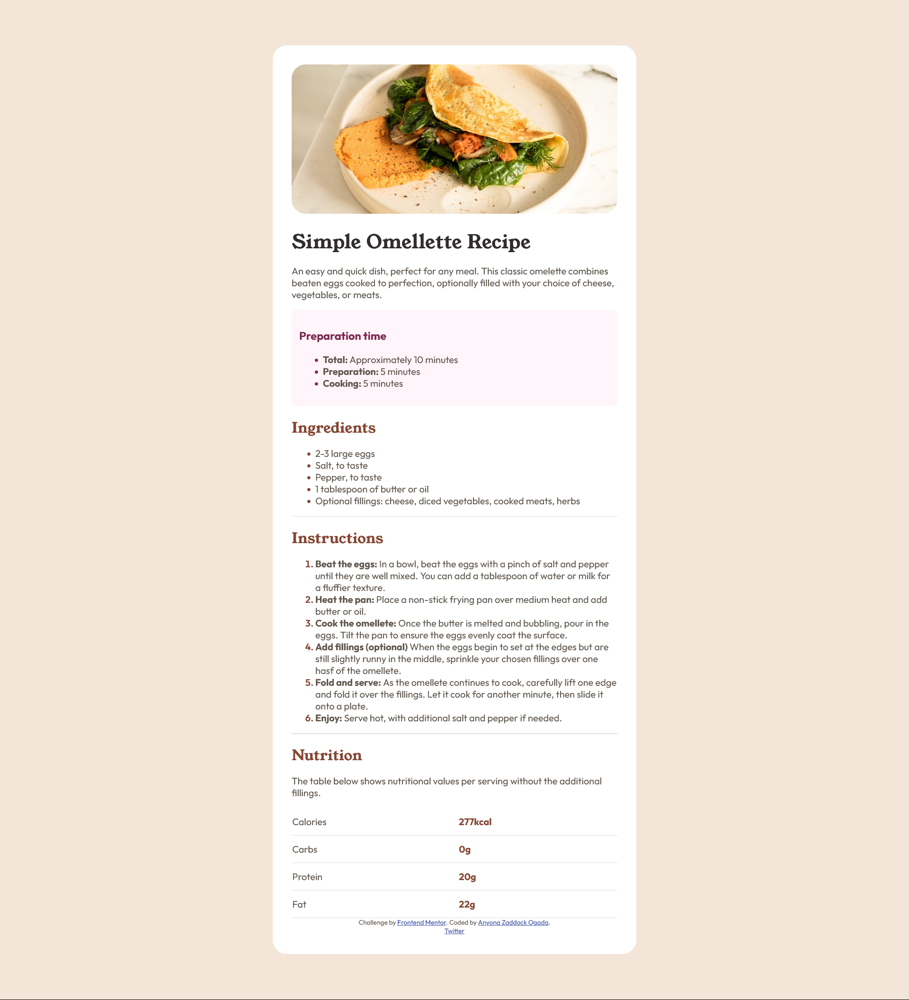
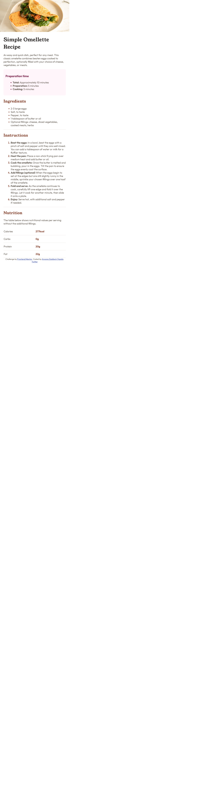

# Frontend Mentor - Recipe page solution

This is a solution to the [Recipe page challenge on Frontend Mentor](https://www.frontendmentor.io/challenges/recipe-page-KiTsR8QQKm). Frontend Mentor challenges help you improve your coding skills by building realistic projects. 

## Table of contents

- [Overview](#overview)
  - [The challenge](#the-challenge)
  - [Screenshot](#screenshot)
  - [Links](#links)
- [My process](#my-process)
  - [Built with](#built-with)
  - [What I learned](#what-i-learned)
  - [Continued development](#continued-development)
  - [Useful resources](#useful-resources)
- [Reviews]
- [Author](#author)
- [Acknowledgments](#acknowledgments)


## Overview
 This project is a solution to Frontend Mentor challenge to create a recipe page that is similar to the desktop and mobile designs I was provided for as jpg photos.
 
 
 
### Screenshot





### Links

- Solution URL: [Add solution URL here](https://your-solution-url.com)
- Live Site URL: [Add live site URL here](https://your-live-site-url.com)

## My process

My process for designing this recipe page was quite simple. This is how I went about it.

  ### 1. Understanding and familiarising myself with the requirements
    - Build the recipe page looking as close to the provided designs as possible
    - The designs were in jpg format so I had to use my best judgement to come close to the designs as possible.
    - I was to use style-guide.md to get further information on the designs.

  ### 2. Come up with a plan for building the project
    After understanding the project requirements, I had to come up with a plan. And I did. Feel free to follow along.
      - I had to organise my thoughts and visualise page. 
      - Drew a skecth on a piece of paper to ensure proper placement of elments and overall flow of information.

  ### 3. Building Up the HTML Structure
    Using my simple sketch I could easily and sematically markup the page content (using HTML) which was readily available in the starter files.

  ### 4. Adding Style to the page
    After organising the page content, I had to bring the page to life and appeal to the eye. 
    CSS would become a very useful tool at this point.

    I created css variables for the various color codes I was provided for. Makes life easier and fun.

  ### 5. Responsive Design
    Responsiveness is always at the core of every web page design. It makes your page accessible to all.
    So I first started out with mobile design. Personally things get easier when you start with mobile design then proceed to desktop design.
    Media query would come to my rescue. 

    From my code you can see I used *ems*, *rems*, and *%* that really made it a breeze in making my page responsive.

    Honestly, it was not a walk in the park :joy:

  ### 6. Accesibility
    I wanted my page to be accessible to all.
    So simply added *alt text* to my image.
    And made it responsive

    Frontend Mentor team did a good job of identifying colours and fonts that made the typography readible.

  ### 7. Testing
    I had to test my page across different browsers to ensure the content on my page was being displayed as intended.
    This was crucial, as from it I could identify styles that were not working in some browsers.

  ### 8. Documentation and Submission
    After I was satisfied with my work, I had to come here and document the whole process. 
    After I'm done here, I will be submitting my work. Wish me  luck!


### Built with

- Semantic HTML5 markup
- CSS custom properties

### What I learned

As a novice web developer, there I learnt a lot. The following are a few I saw fit to mention;

    ### 1. Styling table rows
  ```css
tr {
    border-bottom: solid 1px var(--neutral-light-gray);
   }
```
    ### 2. Creating CSS variables
```css
:root {
      --primary-nutmeg: hsl(14, 45%, 36%);
      }
```

    ### 3. Calling CSS variables

```css
body {
  color: var(--primary-nutmeg);
}
```


### Continued development

Personally, media queries was quite a challenge. 
In future projects I hope to find more projects that has more of responsive design. 
In the mean time I will doing a lot of personal practice at my end so I could ace in making my web pages responsive.

### Useful resources

- [A Complete Guide to CSS Media Queries ](https://css-tricks.com/a-complete-guide-to-css-media-queries/) - This helped me for media queries. I really liked **CSS-TRICKS** because it gave me a comprehensive guide on media queries. Check it out! You will be surprised how much you don't know about media queries.

- [Markdown Cheat Sheet](https://www.markdownguide.org/cheat-sheet/) - This is my first time really taking my time writing a *readme.md* file. I'm not good at writing, but I  saw it fit to start my journey here with writing a markdown. Click on the link above to get started fast with their legend cheatsheet. I believe it is good practice and good manners to have a well written *readme.md*.


## Author

- Website - [Add your name here](https://www.your-site.com)
- Frontend Mentor - [@zacc-anyona](https://www.frontendmentor.io/profile/zacc-anyona)
- Twitter - [@anyona_zadocc](https://twitter.com/anyona_zadocc)


## Reviews
 I invite all kind of reviews and criticisms if any to this project.
 I believe it will aid in my development process in becoming a **Legendary** web developer.
 Feel free to reach out mate.


## Acknowledgments

- I want to thank **Me** for taking my time to complete this challenge.
- I want to thank **Frontend Mentor** for making this challenge available to everyone.